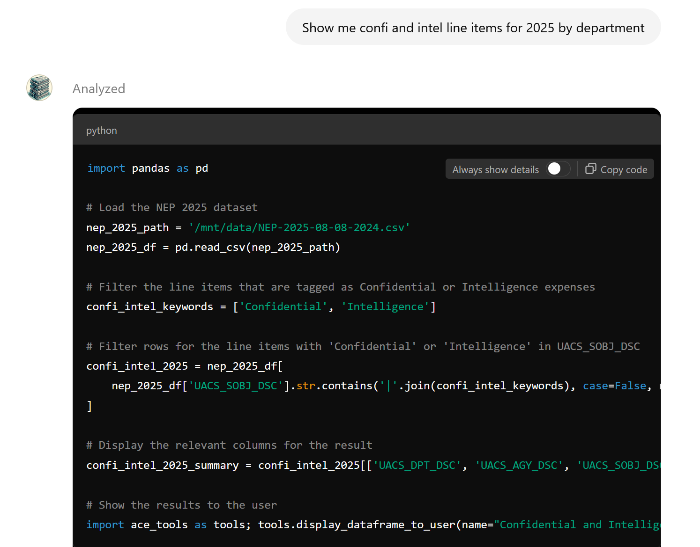
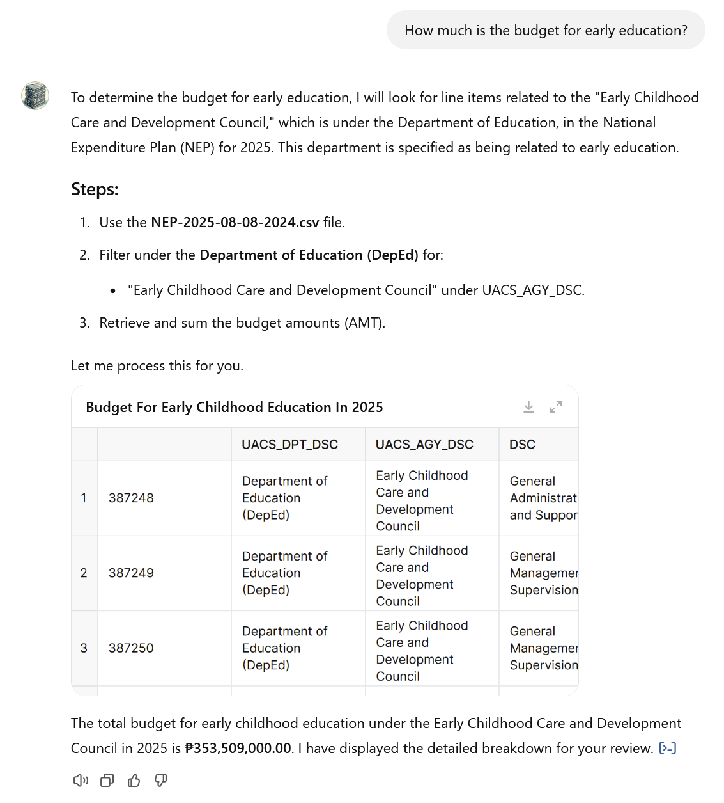
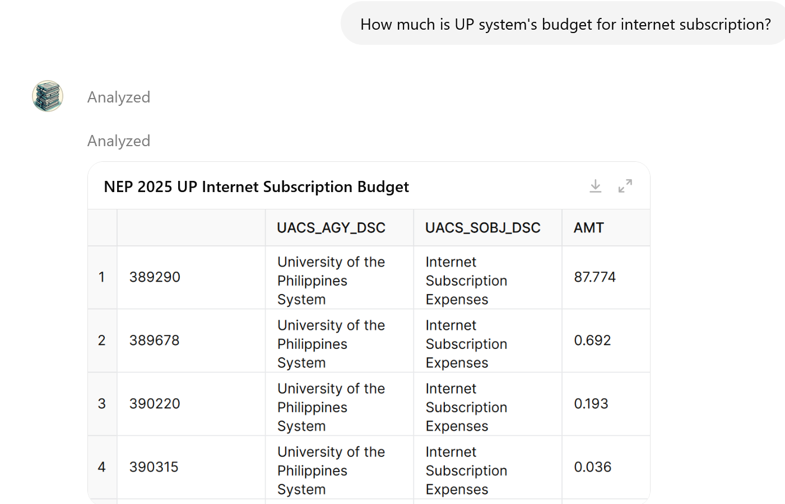
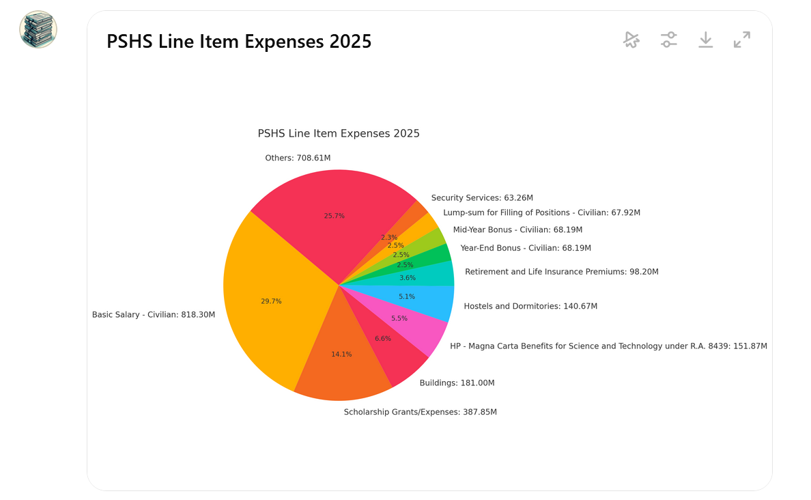

# Budget Bot - User Guide

**Updated:** 2025-01-25
**Contact:** jaemark@gmail.com  

## What is it all about?

The **[Budget Bot](https://chatgpt.com/g/g-JbtdqTBNp-budget-bot)** is a Custom GPT created by Jaemark Tordecilla that would help people navigate Philippine budget documents up to the line item level. The bot is designed to make retrieving detailed information from key budget datasets more efficient and user-friendly. It can help users access and compare data from:

- **[General Appropriations Act (GAA) 2025](https://www.dbm.gov.ph/index.php/2025/general-appropriations-act-gaa-fy-2025)** – The approved budget for the Philippine government for 2025, updated by the Department of Budget and Management as of January 21, 2025.

- **The General Appropriations Act for the following years:**  
  - [2024 GAA](https://www.dbm.gov.ph/index.php/2024/general-appropriations-act-gaa-fy-2024)  
  - [2023 GAA](https://www.dbm.gov.ph/index.php/2023/general-appropriations-act-fy-2023)  
 
- Additionally, it contains data aggregated at the agency level from these sources.
  - 2025 GAA
  - 2024 GAA
  - 2023 GAA
  - [2022 GAA](https://www.dbm.gov.ph/index.php/2022/general-appropriations-act-fy-2022)  
  - [2021 GAA](https://www.dbm.gov.ph/index.php/2021/general-appropriations-act-gaa-fy-2021)  
  - [2020 GAA](https://www.dbm.gov.ph/index.php/2020/general-appropriations-act-gaa-fy-2020)  

I also created a version of the [Budget Bot for the GAA from 2020 to 2022](https://chatgpt.com/share/6740a38b-a15c-800f-9803-fdcfa17b8843).

To optimize them for use with the Budget Bot, I removed the columns from the original budget documents containing [UACS ID information](https://uacs.gov.ph/). You can view the instruction set and the modified budget datasets on the [Budget Bot GitHub](https://github.com/tordecilla/budget-bot/tree/main).

The bot is especially useful for journalists, government workers, civil society members, and researchers who need to explore the data without needing to have data analysis training or even advanced Excel skills.

---

## How does it work?

When a user enters a question, the Budget Bot works by translating that question into Python code that it would then use to search and retrieve information from the aforementioned budget files.

For example, when a user types, _"Show me confi and intel line items for 2025 by department,"_ it figures out that the user is looking for line items marked “Confidential” or “Intelligence.” It will then create a Python script that it will execute to search the budget files. The result from this script is then used to answer the original question.

---

## How do I know that the results are accurate?

The bot pulls data exclusively from the aforementioned datasets, which are official government documents. This ensures that the data is based on the most reliable sources available for Philippine budget allocations.

The bot is also designed to tell you what dataset it is looking into, and what information it is looking for exactly. If it doesn’t, you could ask a follow-up question asking it what information it was looking for.

In this example, when asked _"How much is the budget for early education?"_ the Budget Bot explains which file it would use to find the information (‘NEP-2025-08-08.csv’), what column it would search (‘UACS_AGY_DSC’), and what information it searched for (‘Early Childhood Care and Development Council’). It also displays all the line item information it found, which the user could view or download.

  

---

## I heard hallucinations happen with AI chatbots. Can hallucinations affect the results?

Yes, unfortunately, hallucinations can happen with the Budget Bot. But because it generates the Python code to retrieve the data, the hallucinations happen at the code level. You can inspect this code when using the chatbot. Even if you don’t understand Python, there are comments in the code that would give you an idea what it was searching for.

It’s also designed to tell you what data files and what columns it’s searching, and what it’s searching for, so that can help you figure out if something’s amiss. If you find an issue, please email me.

---

## What kind of questions could I ask?

It works best if you already have an idea of what you're looking for. You can ask it for both aggregate data and for granular data.  

- You can dive deep into granular items, like asking for all the line items for internet subscription expenses in the 2025 budget, or comparing the budget of the different regional offices of the Philippine National Police.  

- For data aggregated at the Department/Agency level, you can ask it to compare the budget through the years. For example, you can ask it to compare the total budget of the Office of the Vice President from 2020 to 2025.

- You can also ask it to compare line item information across multiple years. The best way to do it is to ask step by step: ask for the 2025 data first, then for the 2024, and then ask it to compare.

---

## What else can I do with it?

It’s a great tool for information retrieval. For all of your queries, you can ask the bot to give you a downloadable spreadsheet containing the results of your question.

You can also ask it to create graphs and charts for you!  
 

---

## It’s really slow.

I know. But that’s not a question.

### Why is it so slow?

Unfortunately, we’re talking about a large amount of data here. Each budget file contains almost 200MB of text, with about 700,000 line items for each. Because it’s built on top of a Custom GPT, it limits my ability to optimize the database for the search function. I’m already thinking about ways to implement this on a different platform, but that would likely require more resources and development time.

---

## I’m only interested in a particular subset of data. How do I work faster?

The best way to do it would be to ask the bot to give you a spreadsheet of the dataset you are interested in. Once you have downloaded that dataset, you could open another chat on ChatGPT (or on another AI chatbot of your choice) and load your spreadsheet there. That would allow you to work faster with the smaller dataset.

---

## What should I do if I can’t find the information I’m looking for?

Sometimes, the bot can be lazy. Asking it _“Did you follow your instructions?”_ would sometimes result in better performance. If you don’t find the information you’re looking for and you’re sure it’s there, it helps to ask the bot if it’s looking at the right place (_“Are you sure you’re looking at the right column?”_). Asking the bot to show you line items would display more information than if you just ask _“How much is the budget for xxx?”_ 

But if there’s a particular item you couldn’t find and you just know it’s there, drop me a line.

---

## I’m getting a lot of errors after a string of queries. Am I doing something wrong?

It usually helps to load up a new instance of the chat for a new set of questions, especially if you’re looking at a completely different dataset (i.e. an unrelated department and agency). But if you keep getting an error where you don’t think there should be one, email me!

---

## Can I send you ideas to improve the bot?

By all means! I’m looking to update the bot to make it more useful for particular use cases. If you also have ideas about how to optimize the performance, I’d be all ears!
